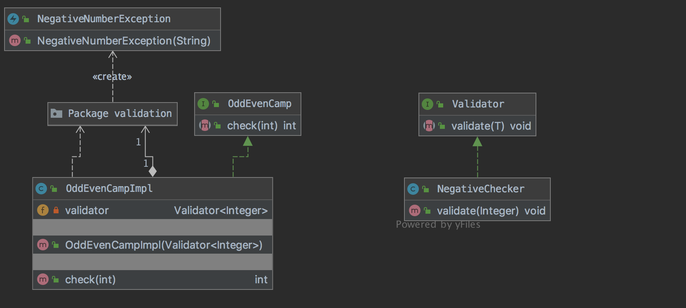

# Getting Groovy with Spock

Spock is a testing and specification framework for Java and Groovy applications. What makes it stand out from the crowd is its beautiful and highly expressive specification language. 
Thanks to its JUnit runner, Spock is compatible with most IDEs, build tools, and continuous integration servers. Spock is inspired by JUnit, jMock, RSpec, Groovy, Scala, Vulcans, and other fascinating life forms.
Spock uses the Abstract Syntax Tree (AST) in Groovy, which removes many of the ceremonial handcuffs that come with other frameworks, creating a fluid test domain-specific language.

## Topics 
- [] Specification `spock.lang.*`
- [] Fixture Methods `[setupSpec(), cleanupSpec()]  [setup(), cleanup()]` 
- [] Feature Method `Heart of the Specification what you are testing`
- [] Blocks `setup -> stimulus -> response -> cleanup  ➰ where` 
- [] Conditions `plain boolean expressions Groovy Truth`
- [] Interactions & Mocks `behavior of objects not just checking state i.e. outcome`

